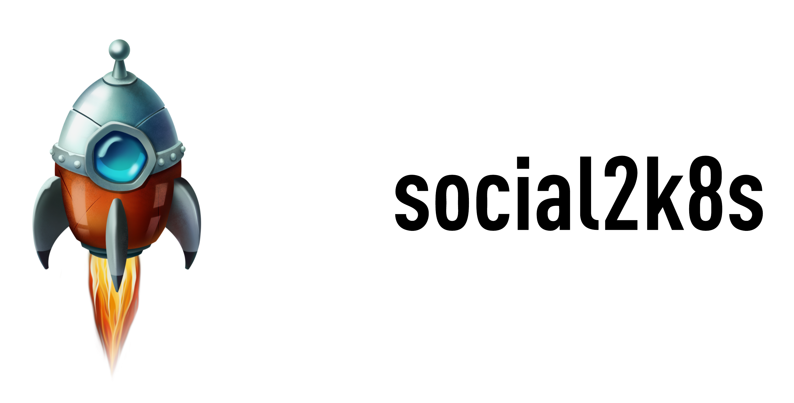

# Welcome

 

Welcome to the social2k8s project. These objects are part of the [k8sb](https://github.com/v8tix/k8sb) project.

#### Prerequisites
* [Minikube](https://kubernetes.io/docs/tasks/tools/install-minikube/) v1.8.2 up and running.

## What this guide covers
1. The social2k8s configuration.
2. Creating the k8s objects.
3. Deploy the application.
4. Clean up.

### 1. The social2k8s configuration.
* :exclamation: On the parent directory you will find a file called const.sh. Please review this file carefully and make the necessary changes.  
* You just need to provide the following information in order to be ready:
  * DOCKER_HUB_USER_NAME.
  * DOCKER_HUB_PASSWORD.
  * DOCKER_HUB_EMAIL.
### 2. Creating the k8s objects.
#### 1. The namespace object.
* Enter to the objects/ns directory.
* Execute ./create.sh.
* :speech_balloon: After creating the namespace, the script points to that namespace automatically.

#### 2. The NodePort service.
* Enter to the objects/svc directory.
* Execute ./create.sh.
* Verify ./get.sh.

#### 3. The Secret object.
* Enter to the objects/sec/docker directory.
* Execute ./create.sh.
* Execute ./definition.sh.
* Enter to the objects/sec directory.
* Execute ./create.sh.
* Execute ./describe.sh.
* Execute ./get.sh.

#### 4. The ServiceAccount object.
* Enter to the objects/sa directory.
* Execute ./create.sh.
* Execute ./describe.sh.

#### 5. The PodSecurityPolicy object.
* Enter to the objects/psp directory.
* Execute ./create.sh.
* Execute ./get.sh.

#### 6. The ClusterRole object.
* Enter to the objects/role directory.
* Execute ./create.sh.

#### 7. The RoleBinging object.
* Enter to the objects/roleb directory.
* Execute ./create.sh.

#### 8. The PersistentVolumeClaim object.
* Enter to the objects/pvc directory.
* Execute ./create.sh.
* Execute ./get_pvc.sh.
* Execute ./get_pv.sh.

#### 9. The LimitRange object.
* Enter to the objects/lr directory.
* Execute ./create.sh.

#### 10. The ResourceQuota object.
* Enter to the objects/rq/cpu_mem directory.
* Execute ./create.sh.
* Enter to the objects/rq/storage directory.
* Execute ./create.sh.
* Enter to the objects/rq/objects directory.
* Execute ./create.sh.

### 3. Deploy the application.
* Enter to the objects/deploy directory.
* Execute ./create.sh.
* Execute ./get_pods.sh.
* Execute ./describe.sh.
* Execute ./get_rs.sh.
      
### 4. Clean up.
* Enter to the objects/clean directory.
* Execute ./delete_all.sh.

## Authors
* Initial work

 
&nbsp;&nbsp;&nbsp;&nbsp;&nbsp;&nbsp;&nbsp;[Contact us](mailto:info@v8tix.com)

## License  
<a rel="license" href="http://creativecommons.org/licenses/by/4.0/">&nbsp;</a>This work is licensed under a [Creative Commons Attribution 4.0 International License](http://creativecommons.org/licenses/by/4.0/).

